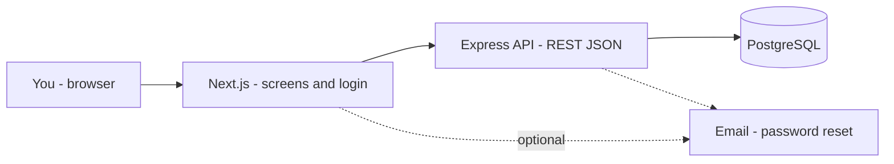

# 🚀 SyncSpace — Project Management Reimagined


**Tagline:** *One shared space where teams stay perfectly in sync.*

> **Deployment note:** Vercel (or another host) deployment guide — *coming soon*. This repo is optimized for **local development** first (Docker Postgres + Express API + Next.js). No AWS or cloud wiring is included in this phase.

---

## 💡 Why the name “SyncSpace”?

- **Sync** — Tasks, comments, and activity stay aligned across the team. One board, one backlog, one source of truth.
- **Space** — Every project gets a dedicated workspace: Kanban, timeline, priorities, and personal “My Work” in one place.
- **Together** — SyncSpace is the single synchronized space where deadlines, ownership, and updates do not get lost between tools.

---

## ✨ What is SyncSpace?

SyncSpace is a **production-style** project management platform: **Next.js 14** (App Router) + **Express** REST API + **PostgreSQL** + **Prisma** + **NextAuth.js** (credentials + JWT against the API). It includes Kanban with drag-and-drop, dashboards, workload heatmaps, priority burndown, command palette, quick capture, focus mode, and more — with a **premium SaaS-grade UI** (Tailwind, shadcn-style Radix components, Framer Motion).

---

## 🦄 What makes it unique?

| Feature | Description |
|--------|-------------|
| 🔥 **Smart workload heatmap** | GitHub-style heatmap for who is loaded on which days. |
| 🎯 **Focus mode** | Full-screen, distraction-free task view (`Escape` to exit). |
| 💓 **Task Pulse** | Activity feed with avatars; dashboard polls every **30s**. |
| 📉 **Priority burndown** | Urgent vs High completions over time (Recharts). |
| ➕ **Quick capture FAB** | Slide-over panel to create tasks from anywhere. |
| 🔒 **Task dependency** | Blocked tasks show a red lock on Kanban cards. |
| 🧑‍💻 **My Work** | Personal overdue / today / this week / done sections. |
| 🖼️ **Smart empty states** | Illustrated empty states with CTAs (not bland placeholders). |
| ⌨️ **Keyboard shortcuts** | `N`, `Ctrl+K`, `D`, `F`, `?`, `Escape` — see in-app help. |
| 🔍 **Command palette** | `cmdk` spotlight for navigation and search. |

---

## 🧩 Key features

- 🔐 **Auth** — Sign up / sign in / sign out via **NextAuth.js** + Express-issued JWT.
- 📊 **Dashboard** — Metrics, Task Pulse, burndown, heatmap, project grid.
- 📁 **Projects** — Full CRUD; status & priority; team linking via API.
- 🧱 **Kanban** — **@hello-pangea/dnd**; columns Todo → In Progress → Under Review → Done.
- ✅ **Tasks** — CRUD, assignee, due dates, checklist (subtasks), comments, attachments API, blockers.
- 👥 **Teams** — Create teams; invite by **username**; roles Owner / Admin / Member.
- 👤 **Users** — Profile + settings (name, email, avatar URL, password).
- 🔎 **Search** — Global search across projects and tasks.
- 🚦 **Priority views** — Filter open work by Urgent / High / Medium / Low.
- 📅 **Timeline** — Gantt-style bar chart per project (Recharts).
- 🌗 **Themes** — Light / dark with **next-themes**; indigo accent; polished motion.

---

## 🧱 Tech stack

| Layer | Stack |
|--------|--------|
| **Frontend** | Next.js 14 (App Router, TypeScript strict), Tailwind, Radix/shadcn-style UI, Framer Motion, Redux Toolkit + RTK Query, cmdk, Recharts, Lucide, date-fns, react-hot-toast, next-themes, clsx, tailwind-merge |
| **Backend** | Node.js, Express, Prisma, **bcryptjs**, **jsonwebtoken**, zod, cors, helmet, morgan |
| **Auth** | NextAuth.js (credentials) → Express `/auth/login` → JWT for API calls |
| **Database** | PostgreSQL (Docker locally) |

---

## System design

SyncSpace is a **simple three-part system**: the **website** you use in the browser, a **backend API** that owns all rules and data access, and a **database** where everything is stored. The browser never talks to the database directly.

**Flow (left → right):**



**What each box does**

- **Browser** — You click and type here (`localhost:3000` when developing).
- **Next.js** — Renders the UI. **NextAuth** handles sign-in; the app then attaches a **token** to API calls.
- **Express API** — One service (`localhost:4000`) for register, login, projects, tasks, teams, search, etc. It checks the token and uses **Prisma** to read/write the database.
- **PostgreSQL** — Users, projects, tasks, teams, comments, activity — all live here (Docker locally).
- **Email** — Only for things like “forgot password” links, if you configure it.

**In one sentence:** *Screens ask the API; the API talks to Postgres; login gives you a token so the API knows who you are.*

For a slower step-by-step explanation (sign-in, dashboard, folders in the repo), see **Architecture — how the pieces work together** below. For every HTTP route, see **API documentation** further down in this README.

---

## Architecture — how the pieces work together

SyncSpace is split into **three main layers**: what you see in the browser, the **API** that enforces rules and talks to the database, and the **database** where users, projects, and tasks are stored. You do not need to be a backend expert to follow this.

### The big picture

1. **You open the app** in a browser (for local development, usually `http://localhost:3000`). Everything you click — login, boards, settings — is served or driven by the **web app** (the `client` folder in this repo, built with **Next.js**).

2. **The web app does not read the database directly.** When it needs data (for example “show my projects” or “save this task”), it sends a **request** to a separate **backend service** (the `server` folder, built with **Express**). That service runs on a different port locally (`http://localhost:4000`). Think of it as the **single front door** for all business logic and data access.

3. **The backend talks to PostgreSQL.** The database holds the real records: accounts, teams, projects, tasks, comments, activity history, and so on. Locally, PostgreSQL usually runs **inside Docker** so your machine matches a simple production-style setup without installing Postgres globally.

Together, this follows a common pattern: **frontend (UI) → API (rules + security) → database (storage)**.

### What happens when you sign in?

- You submit **email and password** on the login page.
- **NextAuth** (in the Next.js app) forwards those credentials to the backend **login** endpoint.
- The backend checks the user against the database (password is stored **hashed**, not as plain text). If it matches, the backend issues a **token** — a short-lived proof of identity.
- That token is kept in your **session** on the web app side. Every later call from the browser to the API can include this token so the backend knows **who** is asking and **what they are allowed to do**.

So: **sign-in is verified on the server**; the UI only holds the result (session + token), not the master copy of security.

### What happens when you use the product (e.g. open the dashboard)?

- The browser loads **pages and components** from Next.js.
- Components **ask the API** for JSON data: projects, tasks, activity feed, analytics, and so on.
- The API **validates the token**, runs the right queries (via **Prisma**, which is the “translator” between TypeScript and SQL), and returns structured data.
- The UI **renders** charts, lists, and boards from that data. If you edit something (drag a task, update a profile), the same loop runs in reverse: **UI → API → database → API responds → UI updates**.

Nothing in the browser is trusted for security: the API always checks **who you are** and **what the rules are** before changing data.

### Where things live in this repository

| Area | Role in plain language |
|------|-------------------------|
| **`client/`** | The website: pages, layout, forms, charts, and the “session” layer that remembers you are logged in. |
| **`server/`** | The API: routes for auth, projects, tasks, teams, search, analytics, etc., plus email helpers (e.g. password reset) and JWT logic. |
| **`server/prisma/`** | The **data model** (what tables exist and how they relate) and **migrations** so the database schema evolves in a repeatable way. |
| **Docker Compose (root)** | Spins up **PostgreSQL** locally so the API has a real database to connect to. |
| **Root `package.json`** | Convenience scripts to run the client and server together or manage the database (see Getting started). |

### One-line data flow (local dev)

```
Browser  →  Next.js (UI + auth session)  →  Express API  →  PostgreSQL
                ↑___________________________________|
                     (your actions and API responses)
```

In production you would host the web app and the API on real URLs (and point the database at a managed Postgres instance); the **relationship** between the three stays the same.

---

## 🏁 Getting started (Windows-friendly)

### Prerequisites

- **Node.js** 20+
- **npm**
- **Docker Desktop** (for PostgreSQL)

### 1. Clone

```bash
git clone https://github.com/YOUR_USERNAME/syncspace.git
cd syncspace
```

### 2. Environment

**Root:** `docker-compose.yml` (optional overrides via `SYNCSPACE_DB_*`).

**Server** — copy `server/.env.example` → `server/.env`:

- `DATABASE_URL` / `SYNCSPACE_DATABASE_URL` — PostgreSQL connection string  
- `SYNCSPACE_JWT_SECRET` — long random string  
- `SYNCSPACE_PORT=4000`  
- `SYNCSPACE_CLIENT_ORIGIN=http://localhost:3000` (used for password-reset email links)  
- **Password reset email:** set **`SYNCSPACE_RESEND_API_KEY`** (see [Resend](https://resend.com)) and optionally `SYNCSPACE_RESEND_FROM`, or configure **SMTP** (`SYNCSPACE_SMTP_*` in `server/.env.example`). Without mail, **local** runs still show the reset link on the forgot-password page and in the API terminal; **production** should use Resend or SMTP so users receive real email.

**Client** — copy `client/.env.example` → `client/.env.local`:

- `NEXTAUTH_URL=http://localhost:3000`  
- `NEXTAUTH_SECRET` — long random string (matches NextAuth requirement)  
- `NEXT_PUBLIC_SYNCSPACE_API_URL=http://localhost:4000`

All custom app env vars use the **`SYNCSPACE_*`** prefix on the server where applicable.

### 3. Start PostgreSQL

```bash
docker compose up -d
```

### 4. Install & migrate & seed

```bash
npm install
cd server
npx prisma migrate dev
npx prisma db seed
```

> **CI / production:** use `npx prisma migrate deploy` when applying existing migrations without prompting.

### 5. Run dev (both apps)

From repo root:

```bash
npm run dev
```

- Frontend: http://localhost:3000  
- API: http://localhost:4000/health  

### 6. Demo login (after seed)

- **Email:** `vidhi@syncspace.dev`  
- **Password:** `SyncSpaceDemo1!`

---

## Screenshots

I will paste screenshots here over time (for example: **login**, **dashboard**, **Kanban board**, **My Work**) so the repo gives a clear picture of the product.

---

## 📡 API documentation

Base URL: `http://localhost:4000` — responses include header `X-App-Name: SyncSpace`.

| Method | Path | Description |
|--------|------|-------------|
| POST | `/auth/register` | Register user |
| POST | `/auth/login` | Login → JWT |
| POST | `/auth/forgot-password` | Request password reset email (`{ "email" }`) |
| POST | `/auth/reset-password` | Set new password from token (`{ "token", "newPassword" }`) |
| GET | `/api/projects` | List projects |
| POST | `/api/projects` | Create project |
| GET | `/api/projects/:id` | Project + tasks |
| PUT | `/api/projects/:id` | Update project |
| DELETE | `/api/projects/:id` | Delete project |
| GET | `/api/tasks` | List tasks (`projectId`, `priority`, `status` query) |
| POST | `/api/tasks` | Create task |
| GET | `/api/tasks/:id` | Task detail |
| PUT | `/api/tasks/:id` | Update task |
| DELETE | `/api/tasks/:id` | Delete task |
| POST | `/api/tasks/:id/comments` | Add comment |
| POST | `/api/tasks/:id/attachments` | Add attachment metadata |
| GET | `/api/teams` | List teams |
| POST | `/api/teams` | Create team |
| GET | `/api/teams/:id` | Team detail |
| PUT | `/api/teams/:id` | Update team |
| DELETE | `/api/teams/:id` | Delete team |
| POST | `/api/teams/:id/members` | Invite by username |
| DELETE | `/api/teams/:id/members/:userId` | Remove member |
| GET | `/api/users/:id` | Public profile |
| PUT | `/api/users/:id` | Update profile / password |
| GET | `/api/search?q=` | Search projects & tasks |
| GET | `/api/activity` | Activity feed |
| GET | `/api/my-work` | Current user’s work queues |
| GET | `/api/analytics/workload-heatmap` | Heatmap data |
| GET | `/api/analytics/priority-burndown` | Burndown series |

---

## ⌨️ Keyboard shortcuts

| Keys | Action |
|------|--------|
| `N` | Open **Quick capture** (when not typing in a field) |
| `Ctrl+K` / `⌘K` | **Command palette** |
| `P` | Open command palette |
| `D` | Toggle **dark / light** theme |
| `F` | Use **Focus mode** from task UI (link in task panel) |
| `Escape` | Close modals / exit **Focus mode** |
| `?` | Shortcuts help |

---

## 🤝 Contributing

1. Fork the repo  
2. Create a branch (`feat/amazing-feature`)  
3. Commit with clear messages  
4. Open a Pull Request  

Please keep changes focused and match existing code style.

---

## License

Licensed under the **MIT License** — see [LICENSE](LICENSE) for the full text.

Copyright (c) 2024 Vidhi Patel.

---

Built with ❤️ by **Vidhi Patel** · Powered by **Next.js**, **Express**, **PostgreSQL**, and **Prisma**.

© 2024 SyncSpace
